# DATAFOOD_2.0
This is the the datafood project but using MySQL and modified

Como abrirlo para MYSQL

1. Instalar MySQl INSTALLER

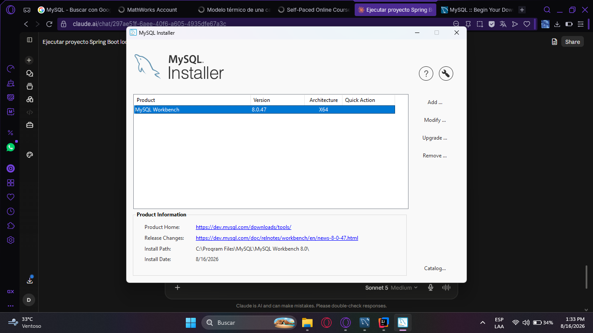 ir al apartado de add y agregarle el MySQL Server 80.6

De ahi seguir estos pasos 
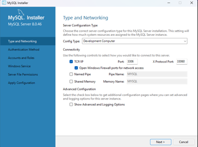

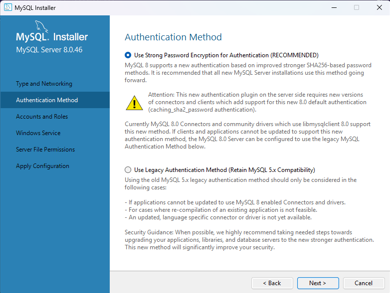

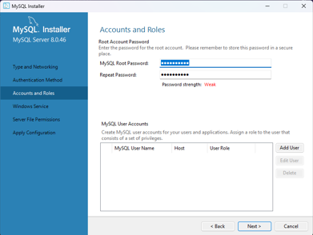 (contraseña propia)

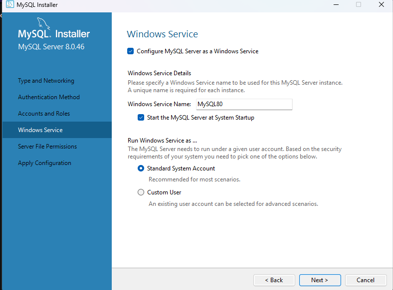

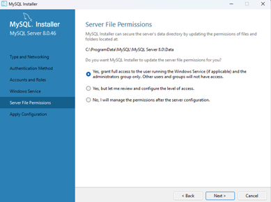
 y luego next next hasta que diga execute

2. Conectar el servidor local 
bajar hasta donde salga un + y ponerle un nombre, le puse local y deje como esta
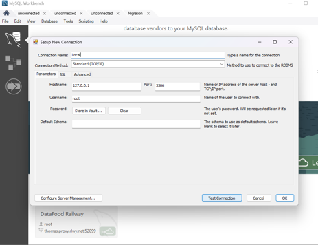

Luego Test Conection

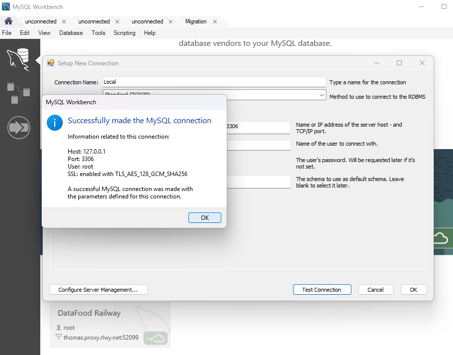

en el apartado de contraseña root poner la contraseña que se puso cuando se instalo
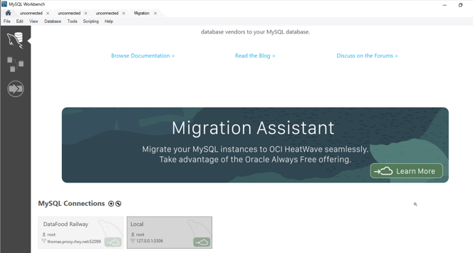

3. listo para ejecutar scripts
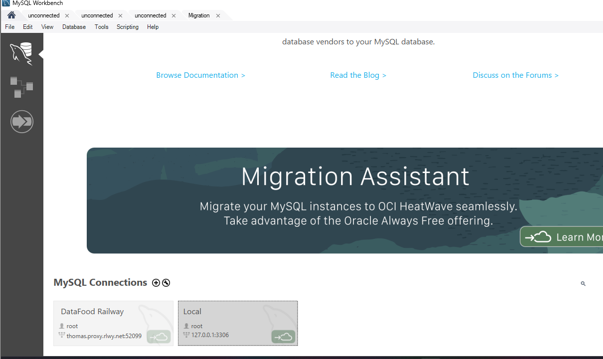

doble click en el servidor que se acaba de crear y debe de abrirse un editor de sql

4.Ejecutar scripts

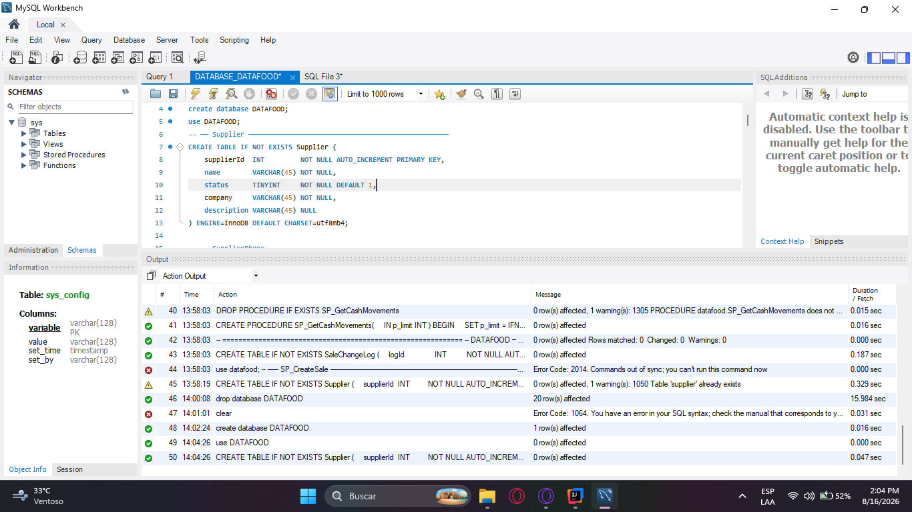

Ejecutar los scripts modulo, por modulo
tabla por tabla
procedure por procedure 
trigger por trigeer en el orden que esta

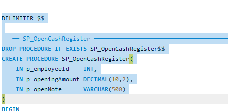
siempre seleccionar para ejecutar 
desde la palabra DELIMETER $$

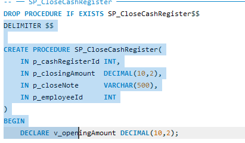

y cuando DELIMETER $$, este despues de un drop
ignorar el drop y empezar desde DELIMETER $$

Para ejecutar es con el rayo

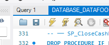

Primero ejecutar todo el DataBaseDataFood, y luego 
el otro script que solo es ingresar un usuario.

5. Coneccion Back

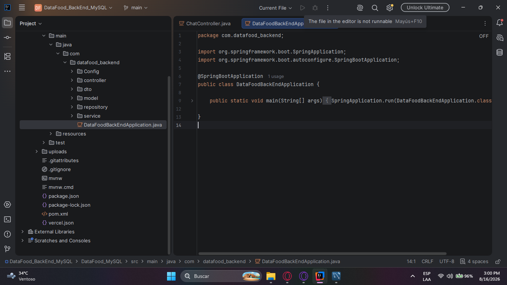
abrir el back y click derecho al archivo pom.xml
y agregar maven

(ya esta todo configurado y con rutas 
de coneccion con la database solo es ejecutar)

6. Coneccion con el front
una vez ejecutado el back 

npm install, para actualizar node 
y luego npm run dev 

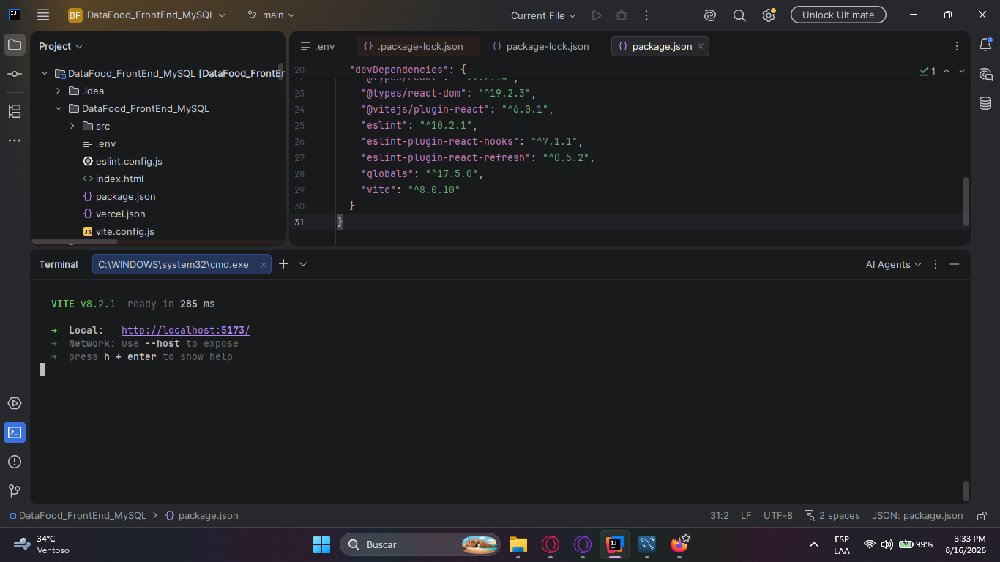

7. 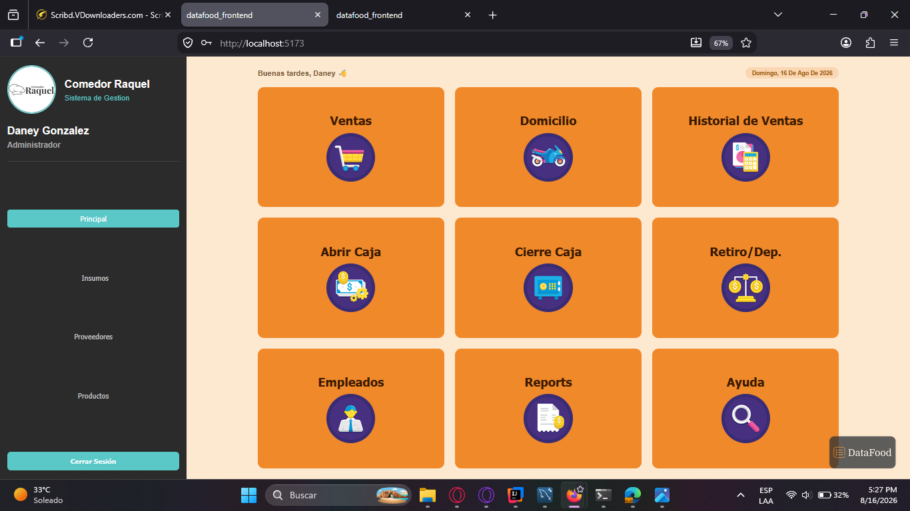 Listo

la password del usuruario es password123